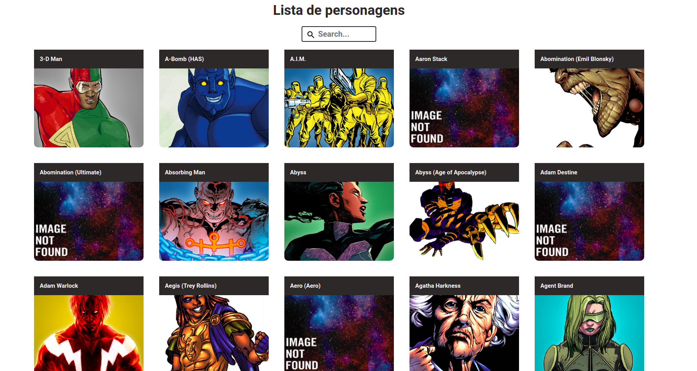

# Marvel Chars

[](https://github.com/DevJoaoLopes/PokeDex/issues)
[](https://github.com/DevJoaoLopes/PokeDex/network)
[](https://github.com/DevJoaoLopes/PokeDex/stargazers)
[](https://github.com/DevJoaoLopes/PokeDex)


Aplicação usando a api aberta da marvel (https://developer.marvel.com/).




- *Home page*


## Tecnologias usadas no projeto

- **react-router**
- **@testing-library/react**
- **axios**
- **styled-components**
- **storybook**

## Rodar o projeto

Para rodar o projeto execute ``` yarn start ```  a aplicaçao ficará disponivel em ``` http://localhost:3000/ ```

Para rodar os testes execute ```yarn test ```

Para visualizar a documentação através do storybook execute ```yarn storybook``` ela ficará disponivel em ```localhost:6006/```
